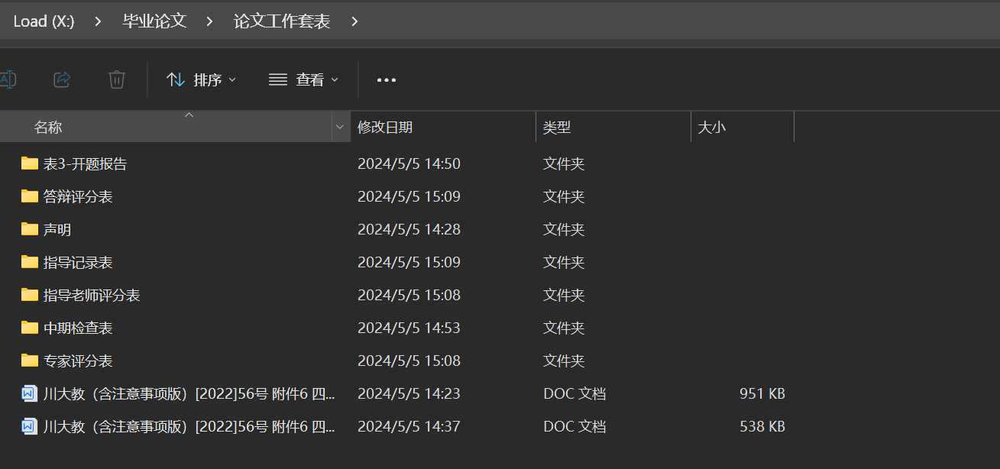

---
# 这是文章的标题
title: 论文摘要
# 你可以自制分析定义封面图片
# cover: /assets/images/cover1.jpg
# 这是页面的图标
icon: cat
# 这是侧边栏的顺序
order: 1
# 设置作者
author: 虚拟发现
# 设置写作时间
date: 2024-05-05
# 一个页面可以有多个分类
category:
  - 文章
  - 经验
# 一个页面可以有多个标签

# 此页面会在文章列表置顶
sticky: false
# 此页面会出现在星标文章中
star: true
copyright: ©虚拟发现
---

<!-- more -->

## 论文摘要写作
乡村旅游是新时代乡村振兴战略的重要突破口，是推动乡村经济社会高质量发展的重要产业体系。随着智能化技术的快速发展，乡村旅游地借助科技展现出新的活力。根植于乡村地区的创业者，是乡村旅游创新发展的中坚力量，在其创新创业过程中会受到不同社会网络关系作用，对创业者创新技术采纳发挥重要影响。因此，社会网络是乡村旅游地创业者新技术采纳的关键影响因素。本研究基于以上思路，结合社会网络理论、创新扩散理论，通过扎根理论分析方法，探讨内在机理，识别了促进和阻碍乡村旅游地创业者采纳生成式AI的社会网络因素，并构建社会网络对乡村旅游地创业者采纳生成式AI影响的作用机理模型。本文的研究结果如下：（1）乡村旅游地创业者采纳生成式AI受到社会网络中的创业者禀赋、生成式AI禀赋、社会情境、技术获取的影响，技术采纳受到技术赋能和采纳效益的反馈作用。（2）创业者自身禀赋的局限性是抗拒生成式AI的主要因素，同时技术供需矛盾也会阻碍创业者对生成式AI的采纳。（3）正式网络在创业者采纳生成式AI过程中发挥主导作用，非正式网络提供的信任机制推动了技术信息的传递。本研究丰富和拓展了社会网络理论和创新扩散理论在乡村旅游中研究内容。同时基于研究结果，本研究提出拓展采纳渠、政策扶持等建议，以期为推动生成式AI赋能乡村旅游创新发展。

## `win+v`调出复制

## word保存

保存在本地防止上传云端后覆盖原始名称，
- 云端保存与本地保存为不同文件，本地保存防止云端文件名称冲突。

## 文件路径

参考文献数据库备份文件，还原后，需要用解压后的文件覆盖原始文件

使用draw.io绘制，图形大小可以统一，文字字体"宋体"、大小"12px"统一，线条粗细1px

以标题加日期结尾-标签-备注，每天一个文件夹。