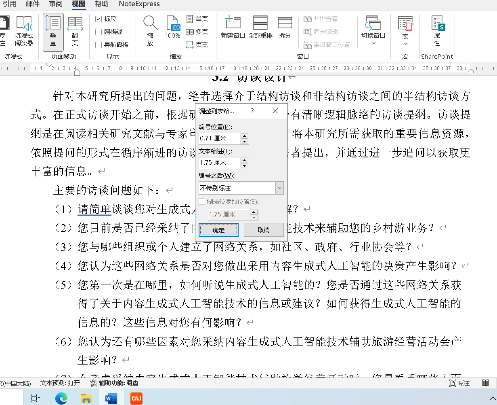
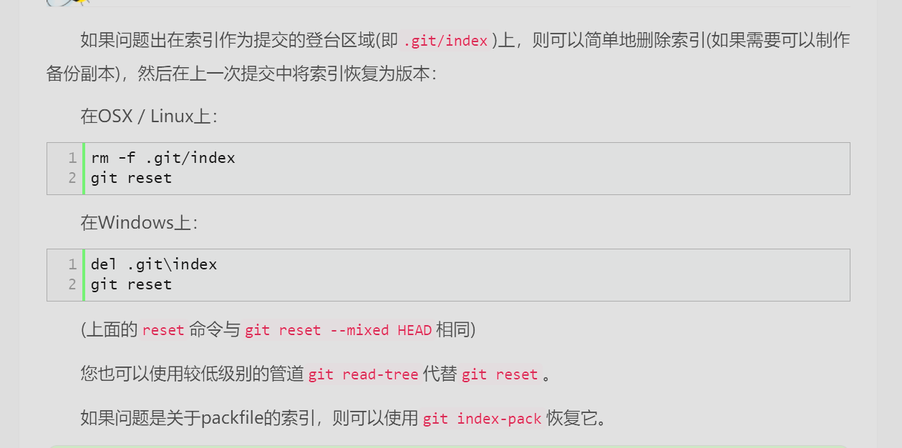

---
# 这是文章的标题
title: 学习笔记
# 你可以自定义封面图片
# cover: /assets/images/cover1.jpg
# 这是页面的图标
icon: file
# 这是侧边栏的顺序
order: 1
# 设置作者
author: 虚拟发现
# 设置写作时间
date: 2024-05-07
# 一个页面可以有多个分类
category:
  - 札记内容
# 一个页面可以有多个标签
tag:
  - 札记
  - 文字
# 此页面会在文章列表置顶
sticky: false
# 此页面会出现在星标文章中
star: true
---

<!-- more -->
## 这是第一个章节

::: tabs#fruit

<!-- 这里，fruit 将用作 id，它是可选的 -->

<!-- 选项卡内容 -->

:::
::: tabs

@tab:active 标题
<!-- tab 1 将会被默认激活 -->
<!-- tab 1 内容 -->
明月几时有，把酒问青天。

@tab 简介
<!-- tab 2 内容 -->
明月几时有，把酒问青天。

@tab 链接
<!-- tab 3 内容 -->
<https://www.zzxxccvv.xyz/posts/%E6%9C%AD%E8%AE%B0/202405/20240507/%E5%AD%A6%E4%B9%A0%E7%AC%94%E8%AE%B0> 
:::
::: tabs

@tab 标题 1

<!-- 此处，选项卡 1 的标题“标题 1”将用作值。 -->

<!-- tab 1 内容 -->

@tab 标题 2#值 2

<!-- 这里，tab 2 的标题将是 “标题 2”，但它会使用 “值 2” 作为选项卡的值-->

<!-- tab 2 内容 -->

:::
一个水果选项卡列表:

::: tabs#fruit

@tab apple#apple

Apple

@tab banana#banana

Banana

:::

另一个水果选项卡列表:

::: tabs#fruit

@tab apple

Apple

@tab banana

Banana

@tab orange

Orange

:::

一个没有绑定 id 的水果选项卡列表:

::: tabs

@tab apple

Apple

@tab banana

Banana

@tab orange

Orange

:::
安装 VuePress Theme Hope:

::: code-tabs#shell

@tab pnpm

```bash
pnpm add -D vuepress-theme-hope
```

@tab yarn

```bash
yarn add -D vuepress-theme-hope
```

@tab:active npm

```bash
npm i -D vuepress-theme-hope
```

:::

安装 VuePress Plugin Markdown Enhance:

::: code-tabs#shell

@tab pnpm

```bash
pnpm add -D vuepress-plugin-md-enhance
```

@tab yarn

```bash
yarn add -D vuepress-plugin-md-enhance
```

@tab:active npm

```bash
npm i -D vuepress-plugin-md-enhance
```

:::


word编号的缩进
`0.71`
`1.75`

针对本研究所提出的问题，笔者选择介于结构访谈和非结构访谈之间的半结构访谈方式。在正式访谈开始之前，根据研究问题设计出一个有清晰逻辑脉络的访谈提纲。访谈提纲是在阅读相关研究文献与专家审核修改的基础上，将本研究所需获取的重要信息资源，依照提问的形式在循序渐进的访谈对话过程中向被访者提出，并通过进一步追问以获取更丰富的信息。

根据已有研究所采用的扎根研究方法，笔者结合所研究问题，选择使用半结构化的访谈方式，以期在按照研究问题框架下获得丰富广泛的信息。在实施访谈前，笔者根据已有研究和相关理论设计出一个逻辑清晰的访谈提纲，尽可能涉及到研究问题的各个层面。在预调研的基础上继续结合相关研究文献以及导师的审核修改的基础上继续完善并确定正式访谈提纲。本研究在依照循序渐进的访谈对话的过程中，通过对问题的继续追问获得了更丰富的信息。

在Nvivo12.0软件中，采用归类建立树状节点的步骤，将开放式编码过程中获取到的子节点经过识别、删除、修改以及合并等程序，在不断归类的过程中建立具有同属归类意义的同一树节点。对开放性编码范畴进行反复分析与梳理，挖掘其内在与外在的共同特征。同时，根据创新扩散理论和社会网络理论，结合相关文献资料以及反复阅读访谈资料，通过对25条开放性编码范畴进行关联性编码，建立同一类属之间的有机联系，本研究最终形成8个主轴编码范畴，


每一个访谈结束后，笔者会根据访谈过程中做的简单记录，及时调整接下来的提问方式以及询问重点，不断改进访谈技巧。在每一次访谈结束后，笔者将访谈录音文件通过软件（讯飞听见、腾讯会议）转录成文本内容。同时，对于软件转录不正确的部分，在每次访谈结束和转录完成后，就根据笔记及时回忆与受访者的对话内容或重点，对转录文字进行修改或者补充，以避免造成信息遗漏或错误。


## 思考结论
:::center
在21世纪，人们对于一些事物的必要性还有怀疑，对于那些并不是自己所想所思考的事物，却会认为是
自己的思考，人对于自己的创造力
有着绝对的信任，当不信任的时候，也不过是谦虚而已。
世界并没有告诉人们，有些定律是人们发现的，而非人创造的，
并没有创造出只有人类才能创造的事物，
无法断言其他的生物不能比人类更早制造出不存在的物品。
通过对已有的微粒的再组配，人类创造了自然无法创造的事物。
但这些必须符合自然规律，
人们也通过制造，尝试发现了规律，
并认为自己能够掌握规律。
但是，这一切都是永恒的，
物理定律比发现这个规律并遵守这个规律更久。
在人类发现自然物理规律之前，
物理规律是什么，人类不了解。
但是上百亿年的宇宙已经在这个物理规律下运行了上百亿年。
即使，
人类在发现自己，
也不过是在物理规律，在宇宙的运行模式下，
发现规律，发现自己，
用人类的行为模式，解释自我，解释宇宙，
什么是真实，什么是描述。
即便是人为规定的事物，是否也需要遵循宇宙的规律，
即便是脱离物质的思维，是否也要基于物质的存在，
才能产生思维的抽象。
那么，即便是不同的宇宙，不同的时间维度，
不同的构成。
对同一客观物质的描述，
不同，相互矛盾。
但是，
都是对客观存在的描述，定义，以生物第三者的身份，
对物质进行了观察，记录，抽象，概念化存在。
如果，物质不在存在了，那么抽象的概念化存在，
还有存在的必要吗，
人类还能理解记忆远古的传说吗，
还有必要进行生物的回溯记忆吗，


:::
## git报错`error: bad signature 0x474e5089 fatal: index file corrupt`

```shell
del .git\index
```
```shell
git reset   
```
```shell
git status                                            
```
