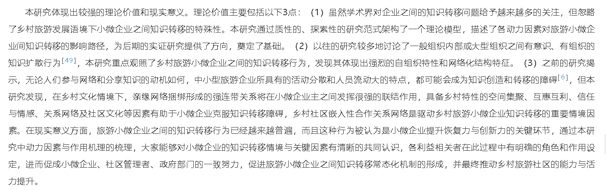

---
# 这是文章的标题
title: 使用盘符
# 你可以自定义封面图片
# cover: /assets/images/cover1.jpg
# 这是页面的图标
icon: file
# 这是侧边栏的顺序
order: 1
# 设置作者
author: 虚拟发现
# 设置写作时间
date: 2024-05-08
# 一个页面可以有多个分类
category:
  - 札记内容
# 一个页面可以有多个标签
tag:
  - 札记
  - 文字
# 此页面会在文章列表置顶
sticky: false
# 此页面会出现在星标文章中
star: true
---

<!-- more -->

## 使用盘符
在使用noteexpress的时候出现了
database disk is mailformate 的错误
这是因为盘符错误导致的
在不同的电脑上使用noteexpress但是硬盘的盘符不同导致的问题
需要让移动硬盘在所有的电脑上保持同样的盘符
## 在不同的电脑上要保证移动硬盘的盘符一致性
在不同的地区使用统一套程序操作时，
必须要保证可移植性，
让文件数据运行在完全一致，包括字面上的
一致的环境中，
这些环境包括，描述环境，表示环境，运行环境，
在版本上，系统上，编码上保持一致性。
## 结论修改
5.1.1乡村旅游地创业者采纳生成式AI受多种因素推动
正式网络是乡村旅游地创业者采纳生成式AI的主要网络力量。乡村旅游地创业者通过政府管理部门、社区组织、业界同行及网络媒体等正式网络，通过“弱关系”，获得更多的生成式AI的信息与技术资源，这为采纳生成式AI提供了坚实的技术获取支持。同时，创业者在获得技术后需要进一步学习使用，相比于非正式网络，创业者建立的正式网络更接近技术，能够为创业者提供获取技术的渠道，或者能够直接给予创业者技术帮助。根据社会资源理论，创业者获得生成式AI技术后会进一步通过非正式网络进行共享或者交流，推动实现利用生成式AI更好的赋能乡村旅游业务并最终实现采纳效益。
内容生成式AI的技术禀赋优势是创业者采纳生成式AI的技术资源优势。内容生成式AI能提供准确全面的回答、创作高质量内容，已有研究表明生成式AI在乡村旅游业务领域能嵌入多场景应用，赋能乡村旅游发展。本研究发现，在受访者看来生成式AI的实用性和创新性已经能够乡村旅游创业者的需求，并在一定程度上提高了他们采纳新技术的积极性。
采纳生成式AI是对乡村旅游的技术赋能。智慧旅游技术是旅游业高质量发展的“新质生产力”，内容生成式AI是智慧旅游技术中的重要组成部分。已有研究表明采纳生成式AI技术能实现人力资本替代优势。基于访谈发现乡村旅游地创业者采纳生成式AI，基本基于目的需求，对于技术的基本原理掌握较少。本研究发现，创业者期望通过采纳生成式AI来降低劳动力成本、提升收入和工作效率，其最终目的是实现经济效益的提升。此外，在实现赋能乡村旅游发展的同时，乡村旅游创业者对新技术充满期待，采纳生成式AI带来的实际效益也反过来会推动对更加先进的生成式AI采纳。

5.1.1乡村旅游地创业者采纳生成式AI受多种因素推动
1正式网络是影响乡村旅游地创业者采纳内容生成式AI的主要网络力量。根据“弱关系”理论，接触的社会网更广，获取的信息资源更多，更利于个体的成长，本研究发现，乡村旅游地创业者主要通过政府管理部门、社区组织、业界同行以及网络媒体等“弱关系”能获取更多的生成式AI的信息与技术资源。根据社会资源理论，社会资源可以被网络成员个体所占有并提升竞争力或促进相互交流，本研究发现创业者在获得生成式技术资源以及采纳生成式AI技术后会进一步通过正式网络进行技术共享或者交流，通过推动实现利用内容生成式AI技术更好的赋能乡村旅游业务。
2内容生成式AI的技术禀赋优势是创业者采纳内容生成式AI的技术优势。

## 启动Office Word时，显示“429运行时错误：ActiveX部件不能创建对象”
关闭word
在noteexpress中卸载word插件，再重新安装word插件

## noteexpress使用经验
使用noteexpress的时候，需要保证篇名的准确性，智能都是使用篇名进行更新。
## 写一点东西
在我看来，人的意义是人为规定的，
但是谁规定了人的人为规定，
谁要求人一定要按照人为规定行事。
当然，我们知道人能够发现自然规律，物理规律，
也能发现运行在物理世界的社会规律。
人们并不是在制定意义，
而是在遵循物理定律和自然规律的
社会规律下，
人为的按照这些规律制定了人类社会的各项规定，
当然也包括人们必须按照人的意义生活。
人无法脱离人的定义生活，
人也无法脱离存在的意义存在。
所以什么是人的意义。
每个人的意义不同，
即便是同一件事，
也会因为价值观，三观的不同，
人会做出不同的价值判断，
价值判断简言之，就是有价值，没价值，有意义没意义之类的判断。
价值判断可以出于理性也可以出于感性，
可以基于经验也可以基于现实此时此刻此地的不同随机应变。
人并不精于按照程序行事，也不精于按照规定行事，
各种各样的规定显示，
有的人不能掌握发现物理定律的能力，
也不能完全掌握社会的各种规章制度。
有人维护规范秩序，有人打破规范秩序。
并非每一个人都在统一的社会规范场下运动，
并非每一个人都能活在统一的规范秩序下，
但是不断变化的规范场塑造着人。
打破规范场可能会带来社会失衡，
也可能没有任何价值判断产生，
也就不会产生任何意义。
## 系统的行为
依照系统的流水线化行为，
即前件的作用产物是下一环节的原材料，
只有前序的结束才能开始下一环节，
当然也要考虑并行流水线，
和缓存机制，
系统并不会因为前件的故障而停止并行运行。
但是，系统会因为前序工程的失效导致后续的运行停止。
前序的失效指的是系统的崩溃。
系统必然是可更新，有容错机制，备份机制的组织。
只有当系统的所有组成部分或者每一环节的输出为空时才会出错。
当然，系统的输出，每一程序的输出可以为空，只需要在定义中
附有意义即可。所以输出没有意义时，才会出错。
## 总结
使用word插入图片
可以在原有的图片上，
选择从剪贴板替换图片
就不需要再改大小格式