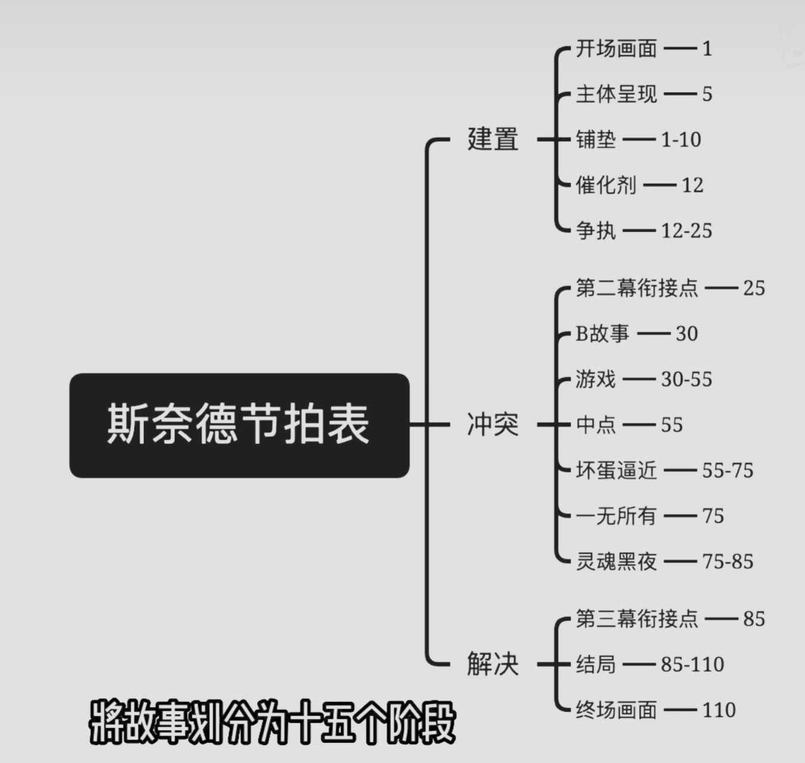

---
# 这是文章的标题
title: 写故事的结构
# 你可以自定义封面图片
# cover: /assets/images/cover1.jpg
# 这是页面的图标
icon: file
# 这是侧边栏的顺序
order: 1
# 设置作者
author: 虚拟发现
# 设置写作时间
date: 2024-05-14
# 一个页面可以有多个分类
category:
  - 札记内容
# 一个页面可以有多个标签
tag:
  - 札记
  - 文字
# 此页面会在文章列表置顶
sticky: false
# 此页面会出现在星标文章中
star: true
---

<!-- more -->

## 写故事的结构
- 冲突理论 渴望，
- 故事曲线 开端，发展，高潮，结局  起承转合  
故事要素，架构
::: details  斯奈德节拍表

:::
激励，拉出舒适区，尝试，取得成果，虚假的胜利，看清的现实，镜像符号。
转折点，面对真相，直面故事。导入事件，衔接故事。
激励、转折、危机
## 非虚构·故事
畅销书里的小故事。
**反差**
人，环境
祈使句，抛出lead
“我”出现在故事中，主观判断，改变文本性质
## 非虚构故事在乎历史吗
非虚构故事必然基于现实的存在性，构建故事脉络。但是如何把历史转换为一个故事，当现实的事件无法提供所有情节时，
一个好的故事不应该局限于支离破碎的没有情节的已知史料。而是通过情节的拼凑与逻辑的推导，构建出一个基于历史基本演绎的故事。
已知的故事几乎无法实现回到历史之前重新进行历史的实践。那么真实的历史本来就无法被观测并记录。生命通过记忆回溯到历史但故事本身也是在创作历史。
同时故事为了更好的传播或者局限于语言水平，理解水平，故事本身就无法还原历史。生命体对历史的记录本身就无法还原现实的发生。
现实存在于过去，但是记录存在于未来。本就是两个不同的时间，本就是两种不同的历史。
所以，文学化的故事，符合传播需要的故事，远比只有简单的记录更为有用，更能提供现实或者说当下讲故事所需达到的目的。
讲故事需要目的，但绝非是复现历史，而是开创历史，创造出故事的历史。

