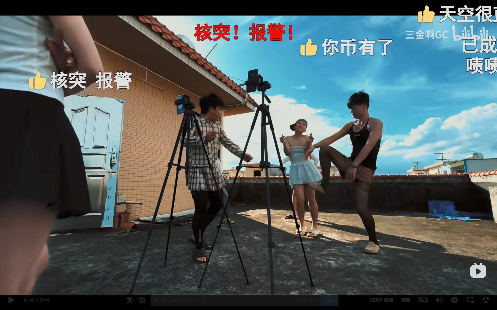
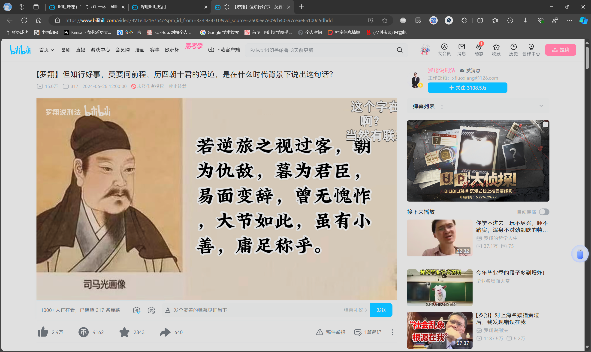

<!-- more -->
[[toc]]
## 网络内容价值判断的快速决策
如何快速决策看到的网络内容的真实性，即观察者对于网络内容的信任程度。网络内容对于观察着的吸引程度。网络内容的观察者对于网络内容的凝视过程与观察者在现实场景中的行为之间的关联性。

## 口语化句式长度
在口语交流中，生物使用的语言口语句式并不会太长，或者说都是以较短的名词与动词的结合形式，或者使用描述词，限定词对于名词或者动词进行修饰或者限定范围。诸如对于自然界的客观物理存在的概念描述时，使用名词，使用动作词描述客观存在的转态转化过程。如动作。动作的描述词大多使用单字，而限定词或者状态描述通常使用两个及以上字组成的词语进行描述。

## 短视频的真实性的意义
通过对现实的事件的提取相关的特征，形成故事所需要的情节元素，如一些视频的切片场景，即分镜，通过分镜，即视频不断地改变拍摄的场景，镜头中主体的背景的切换，以及人物的动作的改变，同一场景中拍摄的角度的改变都是一个分镜。在现实中，诸如人们在面对面的对话中，通过不断改变对话的场景，比如通过移动的方式，改变了对话的场景，在不同的物理位置中，不同或者相同的对话人物或者说是对话内容。在一个相对连贯的情节中，形成了一个相对完整的事件过程即一个故事。通过不断缩小切片的长度，视频观众，凝视视频中的单元无法发现单一切片中的故事完整性，即在长时间的拍摄过程中。与现实不同的是，视频拍摄通常会有较长的时间跨度，事件的过程是一个新信息产生的过程。视频拍摄的长时间跨度，会降低信息的时间属性，或者说。根据现实事件的突发性不可预料性，无法实现满足高质量的长时间的视频拍摄制作的需要。现实生活与高质量的短视频以及长视频在传播的时效性上具有天然的矛盾。

当然，现实世界也同样有精心准备的事件，这些事件的发生是有预谋的长时间的准备的结果。而这些事件也天然的带有类似于表演的性质，即天然的属于计划性事件，其发生的时间地点人物事件等故事的主要要素成分也是生物制定的，在总体上不满足事件发生的不可知性，即便这些事件可能受到非人为因素的干扰。现实事件是否可以与虚拟世界的事件进行分割。
## 短视频的传播意义
视频，或者说任何生物制作或者产生非物质存在的意义，就是为了传播，说着说，非物质存在的存在基础就是其可传播，不可传播的非物质存在就会消失。或者说失去了传播基础的非物质存在就会消失。语言文字，视频内容，音频内容。记录了客观世界的图像内容，说着说依靠介质存储了客观世界的信息，但是单一依靠这些信息，即光学信息并不能实现解读或者传递其中的抽象化概念化信息。信息的传递需要有一套统一的编码。这样才能在构建信息的时候，将信息通过客观存在进行加载压缩，抽象化概念化，之后进行信息传递。接收者，获得信息的载体后，需要使用同一套编码信息，在通过生物体的感受器获取对客观存在的感受后，将编码规范与获取到的客观存在的内容中加载到生物体中的感受信息，进行一一对应，当然，即便，实现了相对的一一对应，还需要与编码规范以及解码者的其他的信息解释规范进行多次或者说，在信息的解码过程中，形成逻辑化的信息，类似于阅读式的短加载过程，即逻辑化的过程，是一句一句被翻译为编码规范要求下的概念表达的。即当编码解释中，一旦出现不合逻辑的地方，解码过程就会停滞，但是前序解码仍产生了一部分合理信息，但后续的编码过程需要，价值判断的加入，或者说需要引入逻辑判断，对无法解码的片段进行判断，以选择是停滞后续解码，还是跳过不合理的部分，即对该部分进行隐式处理，模糊化这部分表述概念，进行下一部分的解码。

在短视频评论中，总可以看到一些对于内容简单的支持或者说根据标题内容，或者说一些简单的概念的一味的叫好，支持。情绪表达表现一致。但，作为一名不评论的观众，或者看完了视频内容的观众，却获得不到评论中表达的情绪，或者说其表达的概念的情绪意义以及逻辑意义。当然，有很多带货主播对产品的简单表达，或者说视频内容与带货内容无关，因为标题绝对与产品不同，所以可以认定视频内容必须且一定与带货产品无关，逻辑意义上的无关，对于大多数为了通过视频获取情绪价值的观众不会主动看一个从来不知道的产品，毕竟知道的产品不需要一个无关的视频进行引流，同样为了通过视频提升逻辑判断或者说理性认知的观众，需要的是一致的内容和高质量的理性表述。视频评论为了提高产品的知名性，或者说为了提升引领效果，在视频下进行了较多的产品相关的评论，更加证实了视频的带货属性。但是，作为专业的观众，对于视频内容的关注应该要比广告更多。短视频的传播，带动了广告的传播，短视频和广告并不是一个概念，嵌入到短视频中的广告，并不会失去广告的属性。但是较多的广告嵌入，让短视频失去了带给观众的高质量的一致性逻辑化表达的需要。广告，使得观众被从视频内容的表达中被瞬间抽离。（20240609）

## 一些关于实际的思考
现实生活中人们对于一些事件的真实性会产生怀疑，在看到网络上的关于现实生活的一些描述会产生怀疑，认为这些视频是相关人物表演的内容并不是真实的。在看到一些视频，是表现相关者的互相之间的动作交互的时候，可以看到这些人物可能存在表演的性质。视频中的人物知晓自己的动作被摄像头记录，在行为的过程中，视频中的人物可能还知道自己的行为被摄像头凝视，或者在视频记录后，还会被互联网中的观众凝视。

一些并不是大众化的视频内容，不属于道德范畴或者违反社会规范的视频。当不被大众观众接受。内容的创造者，也可能会存在认为视频内容不存在被凝视的怀疑。视频人物沉浸在录制视频的环境中，或者说沉浸在行为之中。在不剪辑的视频中，剧本的存在痕迹当不可见时。观众也会有很强的沉浸感，对于视频动作情节的推进也会更关注。

## 真实的记忆
一些时候，我们都希望可以将自己的记忆真实的保留下来。希望可以准确的描述自己的记忆，希望可以用语言精准的描述自己或者他人的经历，客观的真实的。但是，可以发现的是，语言有选择性的将一些细节进行了模糊或者是将一些在客观世界中，带给人以心理上极大冲击的客观经历，描述成了一些只言片语式的语句。在文字上，对于真实的细节，往往需要极大的压缩那些事件的过程，使用极少的文字，为的是带给阅读者以极大的心理冲击。或者说，越是复杂的文字叙述，未必能够带个人以极大的心理冲击。“春秋笔法”这样的极度简化的描述，是因为纸张的宝贵，时间的不富裕，作者对于细节的可以回避，对于人物描写的可以简化，阅读者对于细节的不在乎，亦或是其他的原因。真实，有的时候，并不是阅读者在乎的，有限的时间内，作者在乎的并不是将真实的事件用，抽象化的 语句将事件真实的记录下来。或者说文字本身就无法将客观事件描述出来。文字和语言的结合，将客观事件以一种抽象化的描述，结合客观事件，在人类阅读了作者使用语言进行的对客观事件的抽象化记录后，阅读者是根据自己所处的环境或者说，阅读者必须结合自己的解码系统规则，将记录在各种载体中的语言文字，与自己，即阅读者自己的客观经验的抽象化积累，进行一种对比式解码，才能感受或者说才能解读，作者在文字中所讲述的即抽象化加载的事件。

作者在记录客观事件的过程中，所使用的文字，描述的客观事物，使用的是当前的语言，其所附有的抽象概念，符合作者当前描述的需要。在阅读中，往往需要读者代入作者所处的历史背景，或者说代入到作者的环境。却无法从客观上，代入抽象概念。即以现在的抽象化概念无法解读原始的抽象概念。在语言表达中，阅读者在阅读过程中，对于真实的理解，停留在抽象概念的正确解读上，在抽象概念一致的情况下，作者的语言概念会与阅读者获取的语言概念重合，实现真实的部分传递。这样的真实传递，局限于作者需要或者说作者在创作时，作者自身对于现实真实事件的理解，作者对真实事件的理解，是作者自身的独立意志对于客观世界的价值判断，在某一程度上，并不能全面反映客观事件。读者与创作者发生共鸣。创作者在对客观世界的描述中，需要加载自身的情绪感受，为概念化描述增加真实性的人的情绪倾向。在文字表达中，创作者往往会使用一些肯定性的表达，以加强所表达的概念的情绪。在许多创作中，文字描述的是作者希望传递的情绪价值。作者在文字中，使用肯定式的句式表达，对名词加以情绪词的修饰限定，对代表客观世界的存在的抽象化符号，进行了价值判断表达。文字表达的句式，简单。使用名词与动词的结合，将句式简化，使用多个句式复合组成一个完整的句式。即使用名词加动词加动作行为主体实现了一个句子，而动作对象是客观世界的抽象化符号。
## 真实的感受
在许多时候，生物产生各种不同的感受。对于一些事件。
## 对于一些只言片语的信任
在看到一些只言片语时，就会认为这些东西是真实的，在意这些内容的评价。只知道对于事物的评价，但是对于具体的内容并不了解。但是了解内容是不足够的，对于一事物，了解了全部的内容。类似于将一本书读完后。对于写作水平的评价，对于作者的文学水平，遣词造句水平的评价，认为作者在使用语言文字的水平方面达到了什么程度，是使用了华丽的词语，准确的描述词语，使用了一些可以启发读者的所谓的哲理的表达，使用了可以调动读者的阅读兴趣的一些表达，使用一些带有主观情感倾向的表达句式，使用了对客观事物与主观感情和抽象符号以及抽象概念的复合，实现了对客观事物的抽象化符号表达。这些是对于文本描述的写作的文字本身的书写方式，与作者的文字表达的客观事物不同。不同作者对于客观事物，即物质存在的名词的表达，会存在不同的表达手法。不同的文字描写手法，在虚构故事中，不同的作者对于同样的主题人物，以及故事情节的描述会产生不同的效果。尤其在命题作文中，在使用文字进行抽象化描述中，不同的创作者会使用不同的句式，以及采用不同的事例。在对同一事例的描述中，这种不同的用词描述会产生不同的效果，将故事的发生顺序进行改变。

在对于事物的认知中，大多数时候，会受制于时间的因素，在互联中，也难以找到原有的内容，在现实空间中也难以看到事件发生的全过程，记录并不能被观众通过感觉完全阅读到。在空间中，阅读者获取到的大多数信息是对于客观信息的简述，是对事件的高度概括，时间地点人物行为动作，结论，一些人的观点，以及事件产生的后续影响，包括抽象的和物质的影响。这些简要的信息内容，文字的，语言的，图像的，等。是阅读者在对于未发生在自身的事件中，所能够获取到的信息，阅读者在多数情况下，通过任何渠道，能获取到的信息都不是有阅读者全称参与的，以阅读者作为第一人称发生的事件。即便，是阅读者自身的事件内容，在不产生任何第二观察者的情况下，阅读者本身也会通过自身完成对事件的高度概括，完成事件成为记忆一部分的过程。是的，事件的发生，在存在观察者的过程中，就必然存在记忆化的过程。记忆化的过程要求，事件以高度压缩的信息存储在存储体中，由于信息的传递在大多数时候，是出于被动传递，即事件发生并非是事件主动需要被记忆所以发生，即事件作为运动中的存在状态，不会存在第二状态，即事件与记忆是两种概念和两种存在，记忆属于事件的一环节。没有记忆体的存在事件也会发生。在有记忆体存在时，事件的发生，会激发记忆的产生，实现事件的状态转化，或者说，记忆是由原事件激发的被动的记忆原事件的事件。记忆属于并行与原事件，为原事件服务的事件行为，记忆可以是客观的行为，主动的加载在客观世界的物质的不带有抽象概念符号的表达，即通过对事件的复制，在一定程度上重现原事件的事件行为，亦可以是将原事件进行高度抽象或者是通过符号对原事件进行的记录，这是一种抽象的记录，其在一定程度上，可以通过压缩方法实现对事件的记录，而非重现。

对于客观事物的评价，是一种高度的抽象化表达。丧失了对原有信息的加载，带有的是信息产生者的价值评价信息。而信息产生者未必是事件的经历者，或者连观察者也不是，在信息的传递过程中，评价信息与真实信息的图像信息传递，在现代社会真实信息传递可以通过视频加以佐证。完整的视频信息是事件全过程的信息记录载体。视频信息的评论，在使用非真实的经历者，或者说，通过对事件的相关信息的解读，依靠仅有的信息，所呈现的信息内容，在某种程度上，更多是对于事件的不完整的讲述，而非事件的还原，通过更多的情绪性表达以及逻辑语言的应用，而非是使用动作等描述，事件的讲述，更多的类似于对事件的价值评价，在乎的是事件发生后的影响，更多的是作为事件的观众或者凝视者对于事件的参与者，以及事件的语言描述的一种价值判断。是的，在事件描述中，少有对于事件参与者的手部动作，眼部动作，表情动作，等肢体动作的描述，以及精确到分秒的事件的动作以及动作发生的地点环境等的描写，这些才是事件的信息。大多数事件的表述所使用了行为主体，做了某事，有了某行为，发生了某故事。这些某事，某行为所使用的符号表达，是极为抽象的，在很大程度上保留的是事件，即只是对事件结果的记录，而非过程的完整记录，更并非是对细节的记录，更不是对事件的可还原的记录。（20240619）

## 网络工具的娱乐作用与学习作用
使用互联网平台的娱乐工具是否能够做到学习的目的，在使用类似于B站抖音这些互联网应用，这些平台中的视频创作者上传的视频是否能够为需要学习系统知识的用户提供知识。其实不然。在系统的学习知识方面，大多数用户接触到的是学校，这样的面对面的，应试为主的教育方式。在更多的时候，用户使用的是课本这样的系统的书籍进行学习，学习也是通过一些书本上的题目或者说实践的动手操作，进行检验。将知识与实践活动结合。有的用户还会进一步通过笔记的方法，记录重点，有的会记录自己认为比较重要的知识点，难以理解的知识点。（20240620）
## 行为的仪式感和感同身受
在部分行为中，不同的人物对象，对于事件的发生者会进行凝视，在凝视的过程中，会尤其注意调动感受者的感受能力。通过将被感受者的行为动作与感受着的一些类似的行为动作相联系，将感受者的部分行为动作通过观察的方式，映射到观察者的大脑中。观察者在不动用自己的动作，即观察者不重复被观察的事件活动，即可在感受中试图通过内心的心理活动的模拟，实现对事件的虚拟参与。

类似于观察某些活动，由于事件的严重性，使得周围生物体被活动所吸引，主动或者被动的参与到事件的观察中。在观察过程中，部分生物的神经活动被调动。由于不能具身参与，或者主观上以一个观察者的身份参与到事件的记录过程以及事件的评价过程。行为会带来感受，而观察者会将这些刺激与自身的记忆或者是调动联想功能，实现将具象化的视觉和其他信息收集器官采集到的信息，结合自身的神经感受和分析，得出神经刺激传递，这种由未参与而产生的感受，就类似与具身的实际感受。这种具身感受实际上仍不同于参与者的感受，而是由观察者产生的感受，而这种感受，带来的神经的价值判断，使得观察者认为这就类似于具身参与的身受。在经验记忆的作用下，感受依赖于记忆活动，这种感受更多的指的是通过信息的输入，而产生的感受。这种感受与价值判断这样的经过反复的思考和在收集一定的信息后，做出的抽象化概括化的思维认知不同，感受不需要生成思维过程，不需要使用类似于语言文字这样的基于高度抽象的概念记忆做出的思维判断。

在仪式过程中，生物体被周围环境所裹挟。是否会在仪式化过程中更多的获得感同身受的体验。在仪式过程中，有仪式的主要发起者，主要参与者，更多的仪式参与者，算不算仪式的实际的行为者。可以说，一个仪式的发起，更多的是为了引发包括发起者在内的参与者产生一种参与感，这种参与感，就类似于感同身受，这样的活动的仪式加载。或者说，仪式过程中的诸多环节，不断的将仪式的符号内容，通过环节过程的行为，加载在参与者的感受中，仪式需要的不是参与者对于仪式过程的价值判断，更需要的是参与者在参与仪式活动中，所引发的情绪感受，这一持续的过程，类似于，持续引发参与者的神经分泌多巴胺以及其他使神经感到愉悦的神经递质激素。当然，一些所谓的恐惧化的仪式。

## 文字作为信息传递工具的作用
生物的行为在一定程度上，受到神经细胞的控制。复杂的决策过程需要外部信息的介入，需要有外部的经验的指导。这些经验并不是局限于单纯地逻辑信息，还有实践的信息实践，类似于某事是通过某动作完成的，每一个细节，数量，动作程序的名词化描述。通常是指某事通过某动作进行。不类似于某事必须通过某程序完成。实践经验是方法的呈现，不同的经验，是方法的集合。需要通过某些先关的外部或者内部的品质等抽象或者具体的非动作等的理论化的抽象符号概念，更类似与从理论方面，界定了某事作为某类实践需要达到某些品质才能完成。方法是多样的，但是相关的品质是同样的。信息传递的信息可以是多样的，但是结果也可以是多样的。在传递的过程中，生物无法准确控制信息的接受者的事件行为。加以符号化的概念限制，并不能使得信息中加载方法被反映。并非所有信息都是有方法的信息，有的信息就只是控制性信息，或者说描述性信息与动作类信息。语言中使用文字，可以描述行为发生，当准确描述时，与实践的组成部分一致时，事件可以被实践，实践的成功失败，可进行与不可进行可以被呈现。当描述的信息不准确时，信息接受者可以通过拟合或者概念转化的细节模糊或者是通过关键点的拟合实现，对信息的拟合加载。在价值判断认为，信息不能被拟合加载时，描述的信息会被认为是异常的。

在实践过程中，生物极为依赖于各种指导信息，需要获取其他生物提供的经验，当然这些经验是类似的实践活动所产生的可以被描述为故事的实践经验，实践中的描述，符合实践过程中的各种抽象概念符号，与实践活动中的物品名称一一对应，动词与行为主体可进行的动作一一对应。可以建立起程序化的动作行为，是完成类似事件可以直接遵循的程序化方法。当然，指导信息也可以是简单的指令性语句，通过某动作施加到某主体，在某时某地点以某种角色身份通过某程序性动作指令完成某一行为，这些简单的语句，也可以抽象化为一个简短的故事化语句。

也有一些语句，通过极为概念化的抽象语句，更加强调动作事件主体应以怎样的心理状态活动进行某事，但缺乏指令性动作。更多的是对事件抽象化符号的高度抽象化的概念化的价值判断，认为某行为概念的价值如何。

## 现象与看到的实际
在不同的地区，由于传统或者现在的文化，以及生物的分布的集中性不同，形成了不同的风格的居住建设的模式，不同的模式所耗用的土地面积不同，同时带来的问题也不同。在不同的文化下，不同的地区可能存在。（20240624）

## 针对一些事件的认识
针对网络上的一些热搜，事件的形成，需要有一个人名，一个人做了什么事，其实就是在某种活动中，使用了某种动作，这种活动是大众的，被以往的认识所能够接受的，被记录过的事件活动。某个人参与了执行了某种动作，在某种活动中，完成了某些动作，或者通过某些动作实现了某些名词性成果。后面的就是没有参与到事件中的人物，或者说没有亲身经历过事件的人群发出的评论。这些评论需要在极端的时间内发出，一般不超过一周，即在周一产生的事件大概率不会在下一周的周一还被大众讨论。根据一周有七天计算，事件在一周的周一到周五发生，在周六周日会达到讨论的高峰，而在新的周一事件会平复，不会引发所谓的有网红通过制作所谓的评论视频，基本上就是写一个所谓的稿子，但是，并非是参与者，大多也是评论式的视频。所谓评论式的视频。就是从观察者的视角出发，没有将事件的发生者引入到事件的讨论中。所有的观点是由视频的讲述者或者是文章的作者写出的。

接触到的大多数，文学作品，有虚构的，也有来源现实但改变于现实的，也有不如现实的也有超越现实的残酷的美好的。但没有任何文学作品能够实现真真实实记录现实世界的。凝视的感觉会使现实失真，镜头会使世界变形。在没有镜头没有观察者的空间里，文明是群体性的，但生物个体考虑的不但是文明的延续，生物个体需要延续生命的火种，文明不是生命的火种，但生物个体可以孕育并成为文明延续的火种。没有生物文明毫无意义，没有文明生物延续毫无方向。文明使得生物的延续有了价值，而生物延续实现了物质信息传递演化的物质基础，文明使得生物心甘情愿走向进化的阶段，并矢志不渝的延续生命，并在不断憧憬文明演进到新的阶段。但是，生物的演化是一个漫长的过程，文明的演化是一个从0到1到无穷的，不可发现或者不可超出实践物质基础的认知的精神的神经的，更类似于虚拟的非物质的存在，一个不断重复的状态，就如同储存信息的电子，需要通过某种物理机制，才能实现文明的存储，文明的解读文明的延续。

文明的延续，需要通过物质的存储工具，需要建立相应的解读机制。即使某一天，生物实现了，不需要通过生物个体之间通过生物器官之间的物质介质，形成感觉信息的存储，并建立相应的解码信息机制，一种重复的处理的，将存储的信息通过对应的解码机制的动作记忆，将零散的，有逻辑的信息的原始片段，通过思维思考，建立新的编码形式，输出为新的信息片段，建立出新的理解方法，成为新的知识。有的建立了新的动作程序，建立新的思考的范式，具体到第一要想到什么概念，第二到什么概念，依次，当需要创新时，依靠原有的范式，可以在一个边界清晰的逻辑世界里，随意修改任意几个非关键概念。

##  对于使用和实用的思考
一些网红使用一些人的点赞和购买代言实物的获取的报酬，或者通过直播，直播间的观众打赏的钱，去做所谓的好事。确实是一件好事。但是，通过网红获得的不管是情绪价值还是事物价值，都是需要消费者花费自身合法或者不合法，劳动或者非劳动获取的所谓的等价标的物。但是，在点赞或者购买事物获得情绪价值和物品实物价值时，这未必是等价交换，当然情绪价值或者网红的虚拟价值，对于等价的交换是否的等使用价值，还是认知的人为的随意的价值判断的结果。但是，看到网红的公益，是个人的成功，但是是否也是这些消费者的支持，获得了消费者愿意使用不公平的差价，为网红提供了可以使用销售，并非网红生产的事物，或者是以较低的实物成本，实现了巨大的情绪价值的产出，获得了非劳动的实物的产出。通过巨大的差价，获得的可以实现的公益，是否帮助到了那些需要获取情绪价值和实物价值的人。试问当一个人通过直播打赏，获取到了主播的关注，得到了主播的关注，通过所谓的公益的行为，是否能够帮助到每一个关注主播的人，这又何尝不是一个庞氏骗局，巨大的剪刀差，或者花费在路径上的花费，使得这样的互帮互助，是虚假的，必然是有所损失的，非共赢的局面。所谓情绪价值，忍一忍，其实也就不需要安慰了。

通过残忍的花费时间或者可能需要付出无法享受到长时间的轻松的生活，一些舞蹈学习者，需要通过破坏身体，，达到一种异化的美，一种，从远古时期，人们的幻想中的，实现了的与人的神话的，与祭祀，与延续生命的，展示生命的伟大的，展示生命的生命力的一种，姿态的实现。为了呈现出这样的一系列的动作，或者姿态。舞者需要打破，人类进化的桎梏，通过扭曲身体，关节的角度，实现身体的物理的异化，使身体展现出一种生命力的渴望，对人类的极限的挑战。通过夸张的动作，唤起人类对于生命力延续的渴望。当看到美丽的舞蹈者时，面貌的完美，更需要舞者动作的优美。这种优美与生物的延续的动作过程极为相似。可以说，在某种程度上，其他生物的延续过程所形成的动作过程，其夸张程度不亚于舞蹈。舞蹈的美，在于生命力的，美。一种可以带有性唤起力的美。当然，这里也是一种片面的表达，在各种舞蹈中，舞蹈需要可以唤起的不只是性，还可以是其他的需要情绪与动作参与的行为。一些依赖于情绪作为发起命令或者动作其实思维的行为。可以说舞蹈需要的是感性的美，其所唤起的行为意愿，大多是情绪化的行为，感性的行为。在这里，可以猜测，行为发起时，思维命令发出后，人处于冲动状态，行为的发起需要在行为过程中，保持一个冲动状态，在此状态中，动作的执行，会使得大脑处于宕机状态，即思维不发生作用，即思维无法控制动作的收回。动作一旦发生，需要等到信号回传后，才能有意识。即意识是非连续的，动作也是非连续的。如手指张开，信号发出只能控制手指张开的角度大小，无法在动作执行的同时使动作连续改变。及时同使想到的张开手与握手，其执行是线性的有顺序的。虽然大脑可以不受线性世界限制思维顺序，但世界的顺序性，要求信号的输入输出是线性的，毕竟构建信息思维的基础是线性的，非连续的，有单元性质的。

## 互联网行为观察简单思考
有质量的作品内容，是短时间一气呵成的文字写作过程，还是反复修改文字表达的过程。当需要表达新的哲学内容时，是直接将思考内容，快速记录，再反复修改文字的表达。还是通过不断针对同一思维议题，不断加深思维逻辑的思考，实现逻辑的自洽，再反复重写全部内容，实现内容的复杂化和逻辑表达的简洁化。对于思维写作，通过修改作文一样修改，会破坏逻辑思维的过程。只有直接重写整个思维过程的产出内容，才能实现逻辑思维的表达的更新。

在B站中可以看到这样的视频，视频中的男性穿丝袜超短裙，为的是什么，是为了讽刺，物化女性吗，或者本身就是为了迎合现在的一些需求，一些需要恶搞的恶趣味，一种变态的心理需求，标榜钱不好赚，但是认为有挣快钱的方法，认为挣快钱的方法就是直播，就是目前他们制作视频这样的行为。是的，在目前，制作视频就是这些人的主业。但是，这样的行为也是，一种反映了一些容易进入的低门槛的行业，也就是通过声音，玩弄人体器官，就可以实现吸引人体器官的低级的取乐行为，也是原始人类最开始发现自我意识的方式。但是人类是如何开始从发现认识自我到认识世界，改变世界，是的，这里指的改变世界，不是改变人体行为的世界，而是改造客观的人体结构之外的物质世界，通过改变物质组合，创造出世界中不存在的物品，而非是是让人体摆弄出原有的不同的姿势，让人人组成不同的结构，这样的原始人类也可以做到的低级的肉体的改造。如同穿上不同的服饰，达到不同的性欲的激发以及通过利用生物建立起的语言。

在B站中，关于年轻人或者说一些高中生，类似于还没有进入到社会中从事工作的年轻人，一些处于未进入长时间稳定工作状态的年轻人。网络中的热点出现在周二出现了年轻人的讨论，似乎互联网更多的讨论的是年轻人认知范围中的话题。会关注年轻人与父母额关系，如在高考中的话题讨论，在人物选择中将男性角色列为主要话题引起者，将女性角色列为话题的介入者，推动话题的热点，或者是为话题引入人物的对话，避免人物的思考的自言自语，类似于“二人转”，或者是话题发起者。加入了问题的解决者角色。由介入者的引入，表达出主人公的内心想法。在现实生活中，由于生物的思维是自发的，这里指的思维是基于记忆的不可重复的，可输出的思维语句。话题的讨论，建立在话题讲述者的思维空间中。作品的产出基本上依赖于创作者，而非直接来于大众化的事实的描述。即必然存在不可被记录的细节，在故事讲述时需要被输出，有已记录的细节，在故事讨论时需要被隐去。

文字作品的构建也需要通过创作者，作为讲述者，将已有的建立在实践中的认知，通过思维构建过程，输出为有逻辑的文字内容。文字内容
带有较为明显的逻辑性，故事性。故事通过人物对话，展现故事发展。在故事讲述时，缺乏人物的心理活动或者真实的心理思考过程的描述。只通过语言的输出描写，并没有展现人物的心理思考过程。更类似于简单的故事讲述过程，而非记录真实的人物的事件实践过程，即现实过程中，人物的对话，需要心理活动的介入。而故事讲述通常缺乏这一方面的过程，并没有带入到人物作为一方人物的思考。

在利用事件热点，这些事件通常是时间阶段性，就是这些事件热点通常是可以重复的，每年或者一定时间就会有一个阶段会发生这些，人们关注的事件。

引用一些大众或者是部分人群无法证实的人物的描述，评价，或是借用那些亡人，应用亡人对亡人的评价。反复借用评价，而非使用创作者的评价。是否在讲述真实的话，其实不能。描述或者讲述了那么多话语，其实未必能够达到影响力。一些创作，所谓的借用，并非能够实现讲述所谓的道理。道理的讲述，不一定需要建立在反复引用那些空空的大道理，那些一时容易做到，但是基本无法长期保证一定能达到的道理要求。

## 动物本性的作用的思考
建立在动物生存的本性的基础上，构建出的社会化生活结构。人类在生存过程中，需要快速的做出一些反应，这些反应依靠的是动物的本性，而非文化熏陶的结果。在不断地文化的熏陶过程中，生物将那些无法被生物制定的有利于某些生物的存在的生物的本能反应加以限制性惩罚性的文化的定义，对这些动物的行为加以限制，当行为发生后，就会对生物体做出惩罚性行为。

在文化的熏陶下，通过生物的行为的反复的限制，或者通过构建一些物质化的结构化的客观的限制性的物理的阻碍，限制某些不利于生物体的，当然是社会化后的生物集体或者集体范畴下的生物个体的生存。对生物体的某些动物行为的限制，导致了某些行为不会发生，或者通过在生物的记忆中构建出虚拟的概念，通过生物在发生某些动作之前，做出行为某些动作之前的决策之前，生物体需要通过记忆，来做出是否执行某些动作行为的决策，当通过回忆或者在做出决策时，依赖某些记忆，深刻的记忆做出决策时，需要依靠这些限制。例如从小到大的一些道德上的语言的输入，案例的输入，通过图像或者是语言，讲述同一类的生物行为的某些动作事件，得到了某些惩罚，或者是没有执行相应的动作规范时，受到了某些惩罚。通过输入这些动作程序的执行的程序，以及这些程序执行的前提条件以及每一小分量动作需要满足的前件以及后继动作条件，以及执行了一系列动作的后果，是好的还是坏的。生物还拥有联想的功能，通过想象力，可以将不同的分量组合，使用记忆的前提条件以及相对有限的输出结果。不同的组合方式，就是想象力以及联想的成果。

生物体的想象力是局限的，无法构建出不存在的记忆的前提以及结果，但是可以想象出不同的细节的组合，得出有限的结果。这些结果大多是相似的，前提需要满足一系列的细节的要求。生物体在进化的过程中，需要保持动物的本性，或者动物的本性是推动动物进化的基础，在动物生存的过程中，各种文化以及行为大多是为了满足动物本性的需要。例如生物体都对健壮的生物感兴趣对生长的美丽的有规律的复合美学规律的生物感兴趣。对于动物而言，没有伤痕的长得完美的没有异常的动物，吸引动物眼球的动物大多是在动物眼中能够诞生完美的后代的动物。

不同的时期，通过不断的构建一些不同于以往的文化的需求的文字内容，在文化的初构时代，文字的诞生是一个较长的时期，在初始时间段，由产生自我意识的生物，开始模仿或者通过图示记录描述客观世界的存在，在这个时期，生物已经能够通过使用自然界存在的物质，改造这些物质的外形或者组合这些物质，构建出新的物品存在。文化的产生是便于生物之间的交流的存在，在文明演进初期，生物并不需要认识自我，认识世界，生物需要的是生存的需要，就是活下去，并延续生命。在大多数没有产生文明的生物中，并没有演化出人类这样的社会结构，生物的社会是一个分散的小的区域的社会，或者是一片小世界。在这些生物眼中，世界是分散的，并没有将不同地区的生物统一的必要，或者说，由于生物演化形成的基因遗传下来的生活习性，为了满足基本的生存的需要，部分生物退化或者防止进化出文明或者是选择构建超出生存所需要的大的世界社会的需要。

在小世界中，生物并没有需要进化或者习得语言的必要，在通过动作或者简单的声音，交流中，比更多的文字或者语言的交流更能传递简单的迅速的明确的具有较少歧义的信息。在一个选择封闭的简单社会族群中，退化的交流方式，使得交流或者花费在信息传递上的时间较少，同时，交流方式或者信息编码和解码的方式，较为简单，更加依赖于形体或者动作肌肉的肌肉记忆。通常，简短的信息是，生物常用的信息传递模式。在简单的社会中，需要处理的信息，大多与生存相关，对于思维的信息传递极为缺乏。与生存相关的信息，在面对紧急情况时，文字较声音，肢体动作等无法客观真实，展现情况的紧急。在生存的状况中，动作的产生，通常只需要肌肉的参与。就如同生物的集体狂奔，以及生物的集体发声等，这些行为，可能并不传递语言信息，但是，传递了动作视觉信息和声音信息，这些并不需要加载语言的理解。只需要重复，模仿，通过这些相联系的程序化的相互关联先后行为的前序动作，就能产生下一步的动作的冲动，而不需要进行思维这一并非任何生物都具备的智慧化的决策行为，即通过记忆和自身经验与观察的抑制和思维，延缓了动作的执行。使得相比冲动化的行为，理智行为通常执行的发生较为延后。

动物花费在延续生命的事件，通常占据了生物一生的很长的生命长度。有的生物在经历快速的发育后，很快就具备了生育的能力，并且很多的生物适合生育的生命长度，通常都占据了一生的最长长度。可以说，某些生物的一生都是在为生育而存在。虽然，一些生物，由于自然环境的限制，使得在自然界中，生物在一地球年中，只有一段时间会有爆发式的较长时间的为生育而存在的动作。而有的生物则在一年中，大部分时间都可以为生育服务。

即便是受到，文明的限制，进化的动物，其实也在花费或者在文化的自我的熏陶下，为这样的行为给出，文化的说明。虽然这样的生物，同样符合，其他生物对于生育的不可控的服务的需求的动作执行的本性。很多动物都具备神经来传递冲动信息，控制细胞执行动作。同时神经还挺提供了思考的能力以及判断和存储一些行为模式的的能力。简短的对话，更符合实际社会的生物体之间的交流现状。即对话通常是简短的句子，不超过十几个字，或大多只有一个动词谓词，这样的简单句子，没有修饰词，简单，动词名词这样的几个词语的组合。

## 为什么小女孩更吸引人
在互联网上，以及在现实 世界中，这两种空间是不同的，但是又有相似性。在现实空间中，人如果是在自己的私密空间，即这个空间环境中的事物是属于或者可以又该生物自由支配，例如改变其位置或者存续状态的行为但不会被任何第二者生物产生反馈信息，即其他人有关的事物。人在私密空间中，更加容易暴露出本性。在笔者的思考之下，人的本性，是一种类似于野兽的或者说一种原始的不同正常的秩序的规划的一系列的状态组成。人需要有释放内心中的一些有关行为的想法，将内心中保存的关于一些行为的想法付诸于实际行动的想法。但是由于现实中，这些想法还包括了不想被他人知晓的部分，所以在实际行动中，需要逃避第二者的存在。

借助手机屏幕，通过不是面对面的交流方式，人通过语言、图像进行信息的传递获取，从而与周围环境构建起了一种特殊的私密空间形式。这种形式下，生物此时所观看或者说接受的信息与周围环境所发出的信息是不符合的，同时人也通过减少动作，保持着面对屏幕的姿势，将自己的面部对准了屏幕，使得周围的第二者无法窥探到人此时所处的虚拟环境。虚拟环境此时成为人的私密空间，即便网络逐渐在不同的平台中，形成了许多的虚拟公共空间，在这些空间中失去了所谓的私密空间的属性，人无法放肆的宣泄内心中制造的阴暗的一面。

但是虚拟环境与物理环境不同，不同的虚拟应用构成了不同的平行的虚拟空间，类似于现实世界中，在不同的城市构建起了不同的宏观的私密的物理空间，当然不同大小的只有有限的私密相关的人的空间，也能构成物理世界的私密空间。这里更想辨别的是为何在私密空间人更容易释放内心中不为人知的一面。还有在虚拟空间中人是否在意诚信，或者说在人为的人为的私密的空间下，人的行为在虚拟空间中。在虚拟空间中，人所留下的评论或者说人所表达的信息，当事人会在意其真实性，或者说人会在私密空间中仍然极度在意现实生活中的真实性和诚实性等依靠人类社会的规范建立起的限制人的幻想或者说刻意的编造事实信息。在现实空间中，人会制造谎言，但是面对面的交流使得人，无法一下子接触到大量的谎言。在面对面的交流情况下，谎言容易被不断积累的谎言戳爆，在不断地对话过程中，交流双方极容易发现对话中的逻辑错误，从而发现谁在说谎。在现实社会中，说谎极易造成无法挽回的损失，容易使建立起的文明的表现或者表达坍塌，谎言使得问题无法被解决，使得错误无法被更正，谎言让事件无法按照合理的逻辑进行。是的，谎言误导了事件的进程，真诚的对话使得信息可以准确传递。对于任何存在，信息的传递意味着事件的执行，当信息传递失败或者错误时，会使得所有的努力活着所有的存在都变得毫无意义，信息的产生就是为了传递。

其实什么都是假的，我们看到的也罢，我们听到的也罢，我们触觉到的也罢。终归是要使头脑产生新的想法新的感觉。看到听到触到，却不产生任何思维，是不可能的。
即便是选择控制自己的想法，但是又怎么能控制自己一生呢。不产生想法，最好的办法，就是不使自己接触到听到看到任何东西。可是，人活着就是为了接触各种事物，不产生想法是不可能的。人触碰到什么事物
存在一定的偶然性，同时也会因为年龄的增长，控制力的变化，人会有各种接触不同事物的机会。行万里路，走的路不同，学到的东西不同，也会成为不同的人。但不同的人，是没有多大的区别的，有的仅仅是不同人的标签不同，人和人在其他动物眼中，难道会有天差地别的区别吗，肯定不见得。人用谎言，将各种接触到的事物，以及接触到的事物可以将人塑造成什么样的人。可是，当走到人生尽头，在其他动物眼里，你我皆是一个人的外在形象。在动物眼中，人没有美丑之分，即便是人类的各种判断人的内在或者外在美的规则，在不知道的动物眼中，人毫无差别。在大自然眼中，人和其他动物即便是外在有差别，但是，都只不过是蝼蚁般。即便人类拥有改天换地的能力，但是，在实际的生活中，人还是必须且只能以血肉之躯对抗来自自然界中的一切。我们不可以说，威胁人类的东西，不是人类造出的，也不能说这些不来自于大自然的馈赠，而人类在面对各种威胁时，最终也只能以损害自然之躯为代价。
人会因为落花而伤心，会为动物而仗义行为，也会置同类以死地。动物有自相残杀的本能，同时，也会在本能的驱使之下忘乎所以。 生物的本能本身就来自于物质的本能，物质会相互以随机或者以某种规律，进行碰撞，互相吸收或者排斥，被动湮灭或者主动湮灭。而物质构成的生物体，当获得使用系统制造思维的能力后，又开始欺骗生物体自身。使得认为生物体的思维可以控制生物体的一切。或者说意识认为自己由于没有物质的存在，不受到物质规律的影响，不会出现生物体之间内在或者外在的改变或者湮灭。其实，确实不然。思维的能力，使得人类可以控制身体的器官，使得器官的细胞受到控制。思维作为神经的附属产物。当失去思维后，生物还可以通过简单的神经连接，将各器官联系起来，但也只能像机器一样，缺乏生机。

